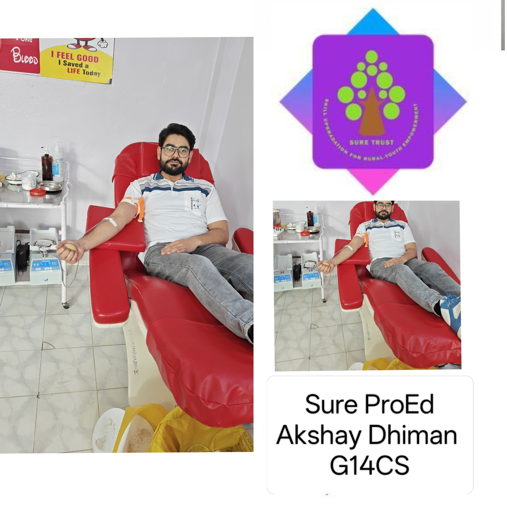
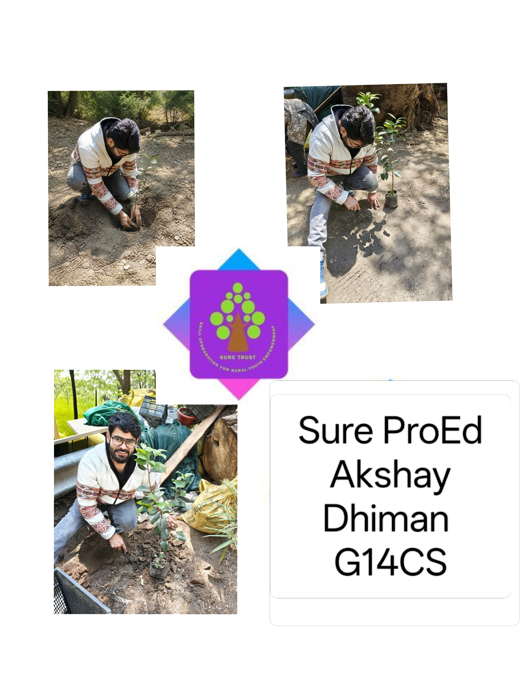
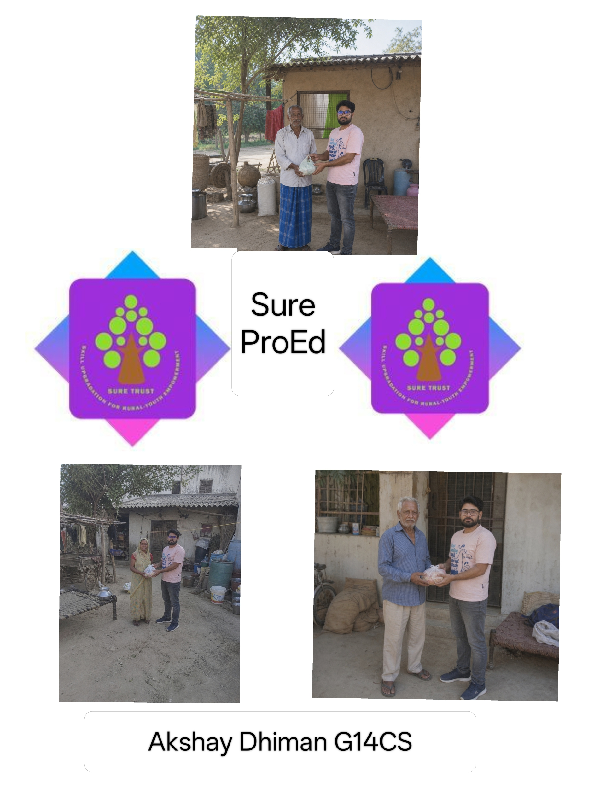

    

<h1 align="center" style="font-family: Arial; font-weight: 600; margin-top: 15px;">SURE ProEd (formerly SURE Trust) 
      </h1>
<h2 style="color: #2b6cb0; font-family: Arial;">Skill Upgradation for Rural youth Empowerment Trust</h2>

<h2 style = "color:#333;"> Student Details </h2>

    
<strong>Name:</strong>Akshay Dhiman 

    
<strong>Email ID:</strong> akshaydhimang14cs@gmail.com

    
<strong>College Name:</strong> Indira Gandhi National Open University

    
<strong>Branch/Specialization :</strong> Information Security (Cyber Security)

<h2 style="color:#333;"> Course Details </h2>

    
<strong>Course Opted:</strong> Cyber Security 

    
<strong>Instructor Name:</strong> Shri. Sen HariHaran 

    
<strong>Trainer Designation:</strong> Security Technician at FCIPL

    
<strong>Duration:</strong> Six months Nov'2025-Apr'2026

<h2 style="color:#333;"> Trainer Details </h2>

<strong>Trainer Name:</strong> Shri. Sen Hariharan

<strong>Trainer Email ID:</strong> harivk1815@gmail.com

<strong>Trainer Designation:</strong> Security Technician at FCIPL

## **Table of Contents**

* [Course Learning](#course-learning-to-be-edited-by-student)
* [Projects Completed](#projects-completed)
* [Project Introduction](#project-introduction)
* [Technologies Used](#technologies-used)
* [Roles and Responsibilities](#roles-and-responsibilities)
* [Project Report](#project-report)
* [Learnings from LST \& SST](#learnings-from-lst--sst)
* [Community Services](#community-services)
* [Certificate](#certificate)
* [Acknowledgments](#acknowledgments)

## Overall Learning

During this course, I learned the fundamentals of cybersecurity.
I gained hands-on experience with various cybersecurity concepts and tools such as Metasploit, Nmap, Wireshark, Cisco Packet Tracer, and Oracle VirtualBox, further strengthening  my skills in problem-solving, teamwork, documentation, and delivering real-world project solutions.

<h2 style="color:#333;"> Projects Completed </h2>

<h3 id="project1"> Project 1: ComplyAI: An Agentic Gap Analysis</h3>

  This project involved designing and developing a basic functional module using the core concepts taught in the course.
  It focused on understanding requirements, creating structured code, and implementing key features.

  <a href= "https://github.com/akshaydhimang14cs/ComplyAI-An-Agentic-Gap-Analysis-Tool/blob/main/SURE%20Trust%20project%20report%20document.pdf " target="\\\_blank"><strong>→ View Full Project Report</strong></a>

## **References**

* [Wikipedia](https://wikipedia.com)
* ISO/IEC 27001:2022 — https://www.iso.org/standard/27001
* NIST Cybersecurity Framework —https://www.wiz.io/academy/compliance/nist-cybersecurity-framework-csf
* ISO 27001 vs NIST CSF — https://www.onetrust.com/blog/iso-27001-vs-nist-cybersecurity-framework/
* Agentic AI and cybersecurity — https://safe.security/resources/insights/understanding-agentic-ai-and-its-cybersecurity-applications/
* Survey of Agentic AI and Cybersecurity — https://arxiv.org/html/2601.05293v1

<!--you can add refrences over here in same syntax as above -->

## **Learnings from LST and SST**

<!-- add your experiences over here -->

During the LST and SST sessions, I learned the importance of discipline, communication, teamwork, and continuous self-improvement. These sessions helped me understand how to work in a structured way, respect responsibilities, and stay committed to my tasks. 

## **Community Services**

<!-- add descreption in your own words -->

During my internship period, through the community service activities, I also developed a stronger sense of social responsibility and empathy toward others. Overall, these experiences were very meaningful for my personal growth and helped me become more confident, humble, and aware of my duties toward society.
### **Activities Involved**

<!-- add the location where you given -->

* **Blood Donation** – Donated blood and supported basic assistance tasks during the camp.

&#x20;<!-- add the location where you have panted -->

* **Tree Plantation Drive** – Participated by planting trees and contributing to environmental improvement.

<!-- add the location where you helped -->

* **Helping Elder Citizens** – Assisted two elderly individuals with simple daily tasks and provided support where needed.

<!-- you can write impacts according to your experience in your words-->

### **Impact / Contribution**

* Helped create a supportive environment during the blood donation camp. <!-- add the location where you given -->
* Actively participated in promoting a greener and cleaner surroundings.
* Offered personal assistance to elder citizens, strengthening community bonds.
* Improved skills in communication, coordination, and social responsibility.

### 

### **Photos**

<!-- add your photos below -->

<!-- change url below with your image urls (inside  src='')-->

* These are just placeholder (sample) images <!-- remove this line -->

## **Certificate**

The internship certificate serves as an official acknowledgement of the successful completion of my training period. It will be issued by the organisation upon fulfilling all required tasks and meeting the performance expectations of the program. The certificate validates the skills, experience, and contributions made during the internship.

<!-- add your certificate image url below (inside src='')-->

\---

## **Acknowledgments**

<!-- you can add Acknowledgments over here in same syntax as below . eg trainer name , company name , role etc -->

* [Prof. Radhakumari Challa](https://www.linkedin.com/in/prof-radhakumari-challa-a3850219b) , Executive Director and Founder - [SURE Trust](https://www.suretrustforruralyouth.com/)

